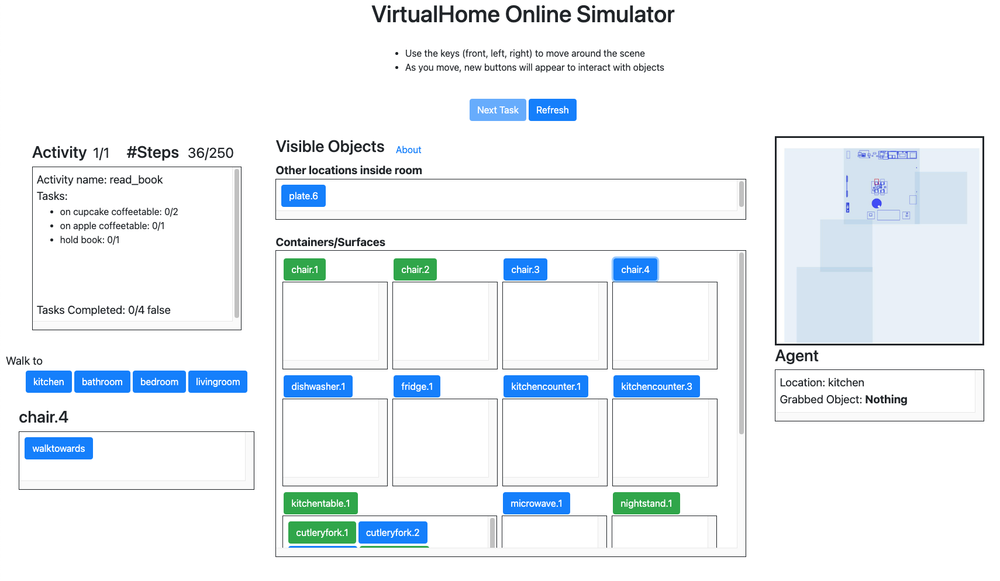

# VirtualHome Data Collection 
Interface for collecting experiments in VirtualHome



## Setup
Clone the VirtualHome repo inside this folder, or create a symlink.

```
cd virtualhome_userinterface
git clone https://github.com/xavierpuigf/virtualhome.git
```

Download and unzip the Unity Executable.

```
wget http://virtual-home.org/release/simulator/last_release/linux_exec.zip
unzip linux_exec.zip
```


## Run the interface

If you are running the demo locally, run:

```
export EXEC="virtualhome/simulation/linux_exec.v2.2.4.x86_64"
python vh_demo.py --deployment local --execname $EXEC
```
Otherwise run

```
export EXEC="virtualhome/simulation/linux_exec.v2.2.4.x86_64"
python vh_demo.py --deployment remote --execname $EXEC
```

Then open a browser, according to the url printed in the terminal

## Graph to GIF

The recorded data is stored in record_graph. You can plot the episodes by running:

```
cd tools
python plotting_code.py --taskname ../record_graph/debugtest/task_0/time.01.25.2022-16.09.32/
```

Where you can replace taskname by a task file inside `record_graph`

It will generate a video of the task you just generated in `tools/default_video.mp4`

## Cite
If you find this code useful, please consider citing our work:

```
@inproceedings{puig2020watch,
  title={Watch-And-Help: A Challenge for Social Perception and Human-AI Collaboration},
  author={Puig, Xavier and Shu, Tianmin and Li, Shuang and Wang, Zilin and Liao, Yuan-Hong and Tenenbaum, Joshua B and Fidler, Sanja and Torralba, Antonio},
  booktitle={International Conference on Learning Representations},
  year={2020}
}
```
